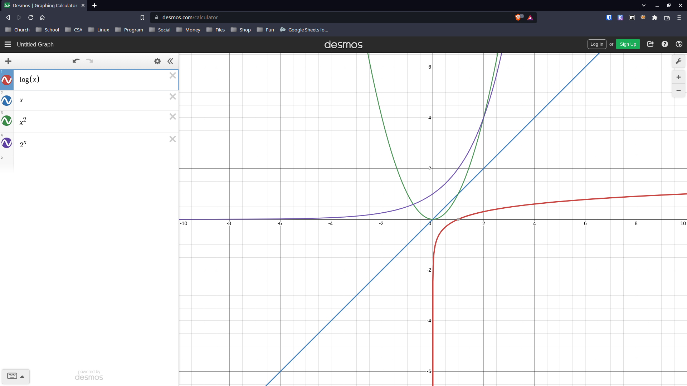

# Welcome

## Overview

Programming languages are full of a vast array of different data structures. When you first start learning, it can be difficult to understand why there are different data structures. In short, the answer is that each data structure is meant to solve a different problem. Queues are amazing at processing data in a sequential order, but aren't very good for checking if an item is in a list. Binary search trees are great for organizing large quantities of information, but you would not want to expect a beginner to know how to use them. An important way of analyzing this information is using Big O Notation, and it is important to understand it.

## Big O Notation

### O(n): Linear

Big O Notation is commonly notated as O(1), O(n), O(n^2), and even O(log(n)). O(n) is loosely interpreted as meaning if you are using a dataset of size n, it will have to operate n times to process all information.
For example, if we had a list that we looped through and printed each item, that would be an O(n) operation. Let's say for example that we print the same item 3 times each loop, which would be O(3n), or even print it 100 times, which would be O(100n); These would simplify to O(n). This is because Big O Notation isn't concerned about how many operations the function performs on each items, it's more concerned about how many times the function repeats itself. So as long as it isn't O(n^2), it is still O(n).

```py
for item in my_list:
    print(item)
```

This code would print each item once. Here is the efficiency graph of an O(n) function.

.png)

### O(1): Single

Now that you understand the basics, it is pretty easy to explain what O(1) means. Regardless of the size of the list, the operation only has to complete itself once and it will be done. This is the golden standard of efficiency, but for many problems it is impossible to achieve O(1). If ```my_list``` had 1,000 items it would still only have to process once.

```py
print(my_list[0])
```

This code simply prints the first item, regardless of the size. Here is the efficiency graph of an O(1) function.

.png)

### O(n^2): Quadratic

This is where operations generally come to be known as inefficient. As with all Big O Notation answers, it largely depends on the type of the problem you are trying to solve. Sometimes O(n^2) is the best solution that can be created. The most common situation to find O(n^2) is where you are looping through a list of items, while already looping throught that loop. Loopception! 

```py
for item1 in my_list:
    for item2 in my_list:
        print(item1 + item2)
```

As you can imagine, this can start to get slow. If you have a list that has a thousand (10^3) items, this will result in looping though a million (10^6) times. With a list of a million items, (10^6) it would iterate a trillion (10^12) times! If you can avoid using and O(n^2) solution, then do so. Here is the efficiency graph of a quadratic operation.

.png)

### O(2^n): Exponential

Now, if you thought quadratic was inefficient, you've got another thing coming for you when looking at an O(2^n). For example, you might have heard of the traveling salesman issue. The reason it hasn't been "solved" yet it's because it's an exponential Big O operation. Here is an example exponential efficiency graph.

.png)

Although at the beginning it may appear to grow similarly to a quadratic graph, it will eventually grow MUCH faster than a quadratic operation.

### O(log(n)): Logarithmic

This is the second best possible operation speed. The best way to describe this is if you were looking for the word "kitchen" in the dictionary. At first, you open the dictionary to the middle. You notice on this page it has words that start with "N". Knowing that "K" is before "N", you will move backwards jumping to the middle between where you were and the beginning. Let's say you land on the "E", you will then move forward since "K" is after "E". You will repeat this process till you find the word. This is a logarithmic search. You didn't have to search every page. You progressively got closer on each operation. With a logarithmic operation the remaining dataset gets smaller each operation. Here is a graph of how this would look.

).png)

### Comparison

From most efficient to least efficient, the operations are as follows:

* O(1): Single
* O(log(n)): Logarithmic
* O(n): Linear
* O(n^2): Quadratic
* O(2^n): Exponential

Here is a graph with all except single for easy comparison. 

