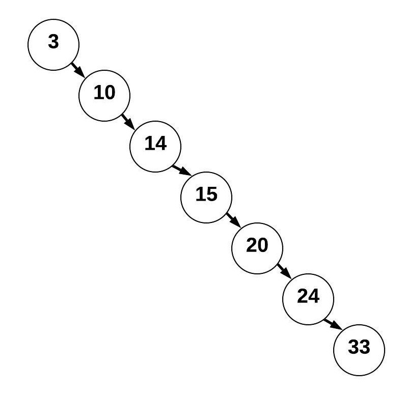

# Tree

## Overview

Trees are the most different, and complicated, of the three data structures covered in this tutorial. They are most similar to a linked list. The easiest way to explain this is with an example.

Imagine you a looking at some sort of family tree. It starts with you, but as you go up, you are connected to both your mother and father. You are linked on the left to your father, and right to your mother. As you continue along the tree each person is linked to their two parents.

Now, if we flip that upside down it makes a tree data structure. The initial node is the root. It is connected to two children, the left and right value. If a node has children it is also a parent. Leaves are the nodes without any children. A classic tree can have an infinite number of children, but we are going to focus on binary trees.


Most commonly, trees are binary search trees, meaning that the value on the left is less than the parent, and value on the right is greater than the parent. This makes it possible to search the tree very quickly. For example, if you wanted to find 14, you would start with the root 15. Since it's less than 15 it looks to the left. It finds 10 there, and since 14 is greater than ten, you look to the right. This process repeats until you find 14, or whatever number you're searching for. This process of searching is known as a recursive search. When we refer to recursion when speaking of a tree, we are normally talking about this process. 


It is important to note that in order to a binary search tree to be efficient, it must be balanced. Searching through a balanced binary search tree is an O(log(n)) function, but searching through an unbalanced binary search tree would be an O(n) function. Trees can become unbalances by starting from the smallest number and adding only larger numbers, or visa versa. Most binary search trees will have functions to balance the tree for this reason.



## Common Operators

### Insert

- This is an O(log(n)) operation.
- The function will recursively search the tree for the next available spot and put the number there.
- As trees have to be built by hand, you use the method you define.

### Remove

- This is also and O(log(n)) operation.
- This function recursively searches for this node and removes it from the tree
- If this node has any child nodes, it requires some cleanup to reconnect it's children correctly
- Once again, use the method you define

### Contains

- This is also a O(log(n)) operation.
- This function just recursively searches the tree until
- This is done by implementing the `__contains__` function, then using ```if data in bst```


### Traverse Forward

- Traverse forward is just a fancy way of saying loop through the list, from least to greatest
- Just like any other data structure, this is an O(n) operation
- This is done by recursively going to the left child, then itself, then the right child. If the child has children, it recursively calls until all have been iterated through
- In Python you do this by implementing the `__iter__` method then using ```for node in bst```

### Traverse Backward

- This is an O(n) operation as well.
- It loops through the tree oppositely, going greatest to least, right to left.
- This is done in Python by implementing the `__reversed__` then using ```for node in reversed(bst)```

### Height

- This is also an O(n) operation
- It works similar to traversal, recursively going through all items, but instead of returning it's value, it returns the greatest depth

### Size

- This is an O(1) operation if you keep track of it when adding and removing items.
- This is done by storing size as variable, implementing `__len__` function, then using ```len(bst)```

### Empty

- This is also O(1). 
- You just compare ```len(bst) == 0```

## Example

If you want to run this code you may visit the [Tree Example](3-1-example.py). Otherwise, it will be demonstrated here. This code specifically demonstrates the insert, traverse forward, and height operations.

```py
class BST:

    class Node:

        def __init__(self, data):
       
            self.data = data
            self.left = None
            self.right = None

    def __init__(self):

        self.root = None

    def insert(self, data):

        if self.root is None:
            self.root = BST.Node(data)
        else:
            self._insert(data, self.root)  # Start at the root


    def _insert(self, data, node):

        if data == node.data:
            return

        elif data < node.data:
            if node.left is None:
                node.left = BST.Node(data)
            else:
                self._insert(data, node.left)

        elif data > node.data:
            if node.right is None:
                node.right = BST.Node(data)
            else:
                self._insert(data, node.right)

    def __iter__(self):

        yield from self._traverse_forward(self.root)  # Start at the root
        
    def _traverse_forward(self, node):

        if node is not None:
            yield from self._traverse_forward(node.left)
            yield node.data
            yield from self._traverse_forward(node.right)

    def get_height(self):

        if self.root is None:
            return 0
        else:
            return self._get_height(self.root)

    def _get_height(self, node):

        if node is None:
            return 0

        left_length = self._get_height(node.left)
        right_length = self._get_height(node.right)
        
        return max(left_length, right_length) + 1


# Test code

tree = BST()
tree.insert(5)
tree.insert(3)
tree.insert(7)
tree.insert(7)  
tree.insert(4)
tree.insert(10)
tree.insert(1)
tree.insert(6)

print ("[", end="")
for node in tree:
    print(node, end=", ")
print("]")

print()

print(tree.get_height())
tree.insert(6)
print(tree.get_height())
tree.insert(12)
print(tree.get_height())
```

Output

```
[1, 3, 4, 5, 6, 7, 10, ]

3
3
4
```

## Practice

### Contains and Traverse Backward

For this practice you will be improving upon the above example. Specifically, you will be implementing the contains and traverse backward operations. You should use the `_insert` and `_traverse_forward` methods as examples of how to do this.

[Tree Practice](3-2-practice.py)

[Tree Solution](3-3-solution.py)